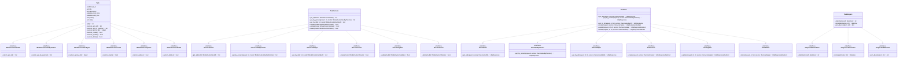

# Blank Class Diagram

```mermaid
classDiagram
    %% Interfaces
    class IModelCustomGetAll {
        <<interface>>
        +custom_get_all(): list
    }
    class IModelCustomGetByParams {
        <<interface>>
        +custom_get_by_params(): list
    }
    class IModelCustomGetById {
        <<interface>>
        +custom_get_by_id(): object
    }
    class IModelCustomCreate {
        <<interface>>
        +custom_create(): bool
    }
    class IModelCustomUpdate {
        <<interface>>
        +custom_update(): bool
    }
    class IModelCustomDelete {
        <<interface>>
        +custom_delete(): bool
    }

    class IServiceGetAll {
        <<interface>>
        +get_all(model: IModelCustomGetAll): list
    }
    class IServiceGetByParams {
        <<interface>>
        +get_by_params(param: str, model: IModelCustomGetByParams): list
    }
    class IServiceGetById {
        <<interface>>
        +get_by_id(id: str, model: IModelCustomGetById): dict
    }
    class IServiceCreate {
        <<interface>>
        +create(model: IModelCustomCreate): bool
    }
    class IServiceUpdate {
        <<interface>>
        +update(model: IModelCustomUpdate): bool
    }
    class IServiceDelete {
        <<interface>>
        +delete(model: IModelCustomDelete): bool
    }

    class IViewGetAll {
        <<interface>>
        +get_all(request, service: IServiceGetAll): HttpResponse
    }
    class IViewGetByParams {
        <<interface>>
        +get_by_params(request, service: IServiceGetByParams): HttpResponse
    }
    class IViewGetById {
        <<interface>>
        +get_by_id(request, id: str, service: IServiceGetById): HttpResponse
    }
    class IViewCreate {
        <<interface>>
        +create(request, service: IServiceCreate): HttpResponseRedirect
    }
    class IViewUpdate {
        <<interface>>
        +update(request, id: str, service: IServiceUpdate): HttpResponseRedirect
    }
    class IViewDelete {
        <<interface>>
        +delete(request, id: str, service: IServiceDelete): HttpResponseRedirect
    }

    class IHelperDatetimeToIso {
        <<interface>>
        +datetimetoiso(dt: datetime): str
    }
    class IHelperIsoToDatetime {
        <<interface>>
        +isotodatetime(iso: str): datetime
    }
    class IHelperJSONDecode {
        <<interface>>
        +json_decode(json: str): dict
    }

    %% Classes (top-down order)
    class Task {
        +UUID task_id
        +str title
        +str description
        +datetime start_time
        +datetime end_time
        +str priority
        +str status
        +__str__(): str
        +custom_get_all(): list
        +custom_get_by_params(): list
        +custom_get_by_id(): object
        +custom_create(): bool
        +custom_update(): bool
        +custom_delete(): bool
    }
    class TaskService {
        +get_all(model: IModelCustomGetAll): list
        +get_by_params(param: str, model: IModelCustomGetByParams): list
        +get_by_id(id: str, model: IModelCustomGetById): dict
        +create(model: IModelCustomCreate): bool
        +update(model: IModelCustomUpdate): bool
        +delete(model: IModelCustomDelete): bool
    }
    class TaskView {
        +get_all(request, service: IServiceGetAll): HttpResponse
        +get_by_params(request, service: IServiceGetByParams): HttpResponse
        +get_by_id(request, id: str, service: IServiceGetById): HttpResponse
        +create(request, service: IServiceCreate): HttpResponseRedirect
        +update(request, id: str, service: IServiceUpdate): HttpResponseRedirect
        +delete(request, id: str, service: IServiceDelete): HttpResponseRedirect
    }
    class TaskHelpers {
        +datetimetoiso(dt: datetime): str
        +isotodatetime(iso: str): datetime
        +json_decode(json: str): dict
    }

    %% Implementations
    Task ..|> IModelCustomGetAll
    Task ..|> IModelCustomGetByParams
    Task ..|> IModelCustomGetById
    Task ..|> IModelCustomCreate
    Task ..|> IModelCustomUpdate
    Task ..|> IModelCustomDelete
    TaskService ..|> IServiceGetAll
    TaskService ..|> IServiceGetByParams
    TaskService ..|> IServiceGetById
    TaskService ..|> IServiceCreate
    TaskService ..|> IServiceUpdate
    TaskService ..|> IServiceDelete
    TaskView ..|> IViewGetAll
    TaskView ..|> IViewGetByParams
    TaskView ..|> IViewGetById
    TaskView ..|> IViewCreate
    TaskView ..|> IViewUpdate
    TaskView ..|> IViewDelete
    TaskHelpers ..|> IHelperDatetimeToIso
    TaskHelpers ..|> IHelperIsoToDatetime
    TaskHelpers ..|> IHelperJSONDecode
```
